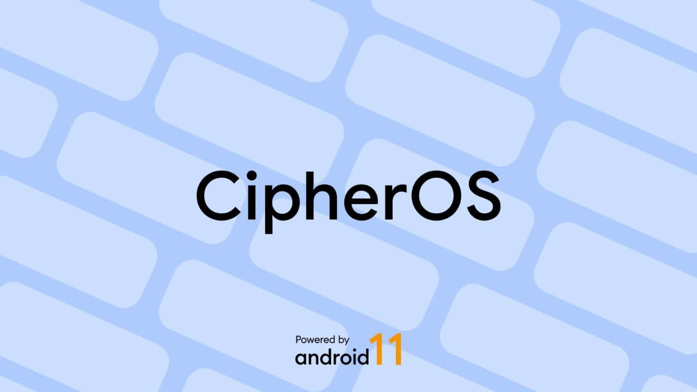

### Applying for CipherOS Official ### 

#### Requirements : #### 

- Maintainer should have proper git knowledge (e.g. how to cherrypick, etc.)
- Maintainer should **NOT** build on trial servers.
- All trees should be public and posted on GitHub.
- Trees should have complete hardware compatibility as compared to stock ROM. VoLTE / VoWiFi can be ignored.
- Your kernel should **NOT** be overclocked.
- You must show the **real** device sources being used.
- Respect authorships.

We don't really have a build server (as per for now), but if you really have trouble updating CipherOS officially for your device, we will try to help.

If you're ready to tame the beast, PM [Aryan Sinha](https://t.me/techyminati) or [Jamie](https://t.me/henloboi) on Telegram with your device sources. We will get back to you as soon as possible.